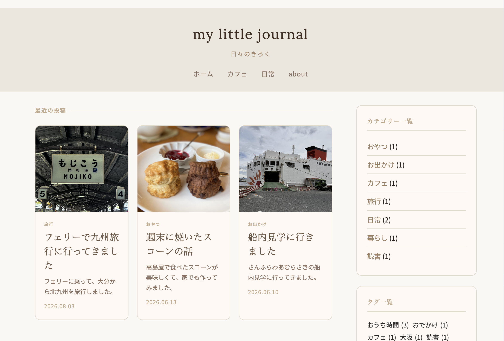

# my little journal

日々のきろくをつづる個人ブログ。

## 概要

- カフェ・おでかけ・日常・暮らし・読書・旅行などをテーマにした個人ブログ
- WordPressオリジナルテーマを自作

## 使用技術

- WordPress
- PHP
- HTML / CSS
- JavaScript
- プラグイン：All in One SEO / UpdraftPlus / Smush

## 機能

- カテゴリー別記事一覧
- バックナンバー表示
- サイドバー（カテゴリー・タグ・カレンダー・Aboutウィジェット）
- 関連記事表示
- OGP設定
- favicon設定
- 404ページ

## フォルダ構成

```
my-little-journal/
├── images/
│   └── avatar.png
├── js/
│   └── scripts.js
├── template/
│   └── post-template.html
├── 404.php
├── archive.php
├── category-cafe.php
├── category-nichijo.php
├── category-odekake.php
├── comments.php
├── footer.php
├── functions.php
├── header.php
├── index.php
├── page.php
├── sidebar.php
├── single.php
└── style.css
```

## スクリーンショット

